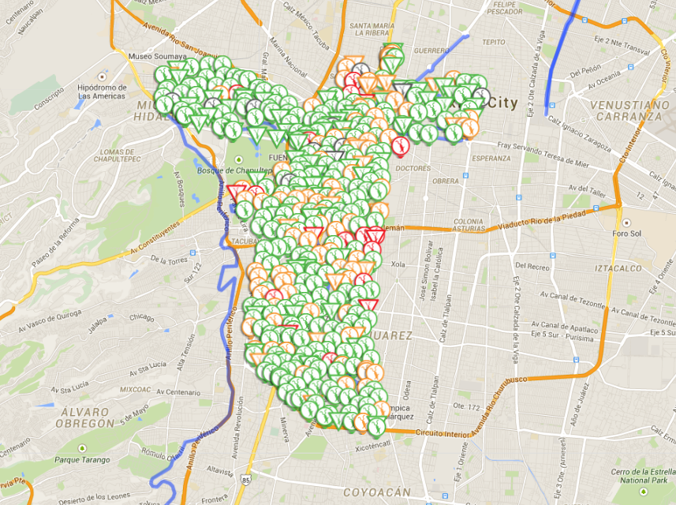

# Temas
## Cobros 
# Requerimientos.

Antes de poder definir lo que es esperado de un sistema de monitoreo en tiempo real de los cajones de estacionamiento de una ciudad, cabe desmenuzar el sistema actual de ecoparq para conocer sus flaquezas y poder proponer una solución integrál que tenga como objetivo final mejorar la movilidad en la ciudad.

## Actores
En primer lugar se busca entender cuales son los actores del sistema actual y cuales son sus funciones.

El actor más evidente es el conductor que está buscando donde estacionarse. Dicho conductor genera tránsito entre más tiempo esté merodeando la zona en la cual quiere encontrar lugar. Es reportado que el 30% del transito en los lugares más conflictivos se produce por éstos. El conductor es responsable de pagar su boleto de parquimetro y de situarlo en el tablero del vehículo de modo visible. En su caso tambíen tiene que cubrir el costo de la multa y el retiro de la "araña" en caso de ser infraccionado por el sistema ecoparq.

Las empresas se encargan de instalar los sistemas físicos que proveen de boletos, cobrar por el tiempo de estacionamiento y entregar el dinero a Gobierno.

Los policías y miembros de ecoparq se dedican a rondar los poligonos de parquimetros en busca de automoviles morosos, que no hayan pagado o que hayan inclumplido en colocar el boleto en el tablero del coche de forma visible. Son responsables de colocar los inmovilizadores de coches y de retirarlos una vez que se hayan cubierto las sanciones económicas correspondientes a la multa y al retiro de inmovilizador.

El gobierno tiene como función recaudar el dinero pagado por los conductores y destinar el 30% a obra pública y a la recuperación del espacio público.

## Requerimientos
Ya que se tiene una idea más clara de quienes actuan en el sistema y la manera en que interactuan, es hora de encontrar cuales son los puntos débiles más comunes en el aspecto operativo de el sistema ecoparq y más alla, de estacionarse dentro de las zonas más con las vias más disputadas en cuestión de estacionamiento. De esta manera proveer de una solución que mejore de manera considerable la operación de dichos espacios.

## Requerimientos del sistema para conductores.

La forma más sencilla de conocer los problemas más comunes por parte de los usuarios fue con una serie de entrevistas con los conductores.

En entrevistas verbales con los usuarios de ecoparq, se encuentran los siguientes puntos. 
* Tuve que salir de mi edificio para pagar el parquímetro
* Tuve que cambiar un billete para pagar el parquímetro
* Tardé mucho en encontrar lugar.

Como se vé, los primeros 2 puntos se refieren a las complicaciones que tienen las personas al pagar el parquímetro. Por lo tanto el sistema propuesto requiere que los pagos se hagan desde un lugar remoto. Al mismo tiempo, el sistema debe poder aceptar pago con tarjetas de crédito.

De forma menos sutil, el tercer punto se refiere a un problema de desconocimiento. Dicho problema alude a que cuando un conductor llega al área cercana a su destino, la única información con la que cuenta para tomar una decisión es lo aquella que le provee la calle sobre la que se encuentra. Esto es áltamente problemático ya que resulta aleatorio o "suerte" encontrar un lugar libre. Han habido ocaciones en mi experiencia personal donde estacionar el coche en la calle toma 40 minutos.

Por lo tanto resulta imperativo el requerimiento poder saber en tiempo real la disponibilidad y ocupación de las calles de forma remota.
Además, ésta información debe ser accesible a los ocupantes de un vehículo en movimiento.

## Requerimientos del sistema para policías.

En entrevistas con los oficiales de transito y miembros de ecoparq encargados de multar y colocar las "arañas", en realidad no mencionan ninguna queja. En cuanto a la respuesta que dan al preguntar sobre la estrategia seguida para encontrar vehículos morosos es muy interesante. Simplemente recorren las calles, revisando "papelitos" en los autos y multando a quien encuentran.

Resulta alarmante la estrategia que utilizan. Es cuestión de alatoriedad el que se encuentre a los conductores que ya sea intencionalmente o por descuido dejan de pagar el parquimetro sean encontrados. Además se incentivan las mafias donde la gente se ponga de acuerdo con los vigilantes de los cuadrantes de ecoparq para no ser multados y así cometer corrupción sin conocimiento del gobierno. El problema más importante para la operación de los parquímetros, al igual que con los conductores resulta ser el desconocimiento. El tener que revisar manualmente y físicamente un papel para determinar quienes faltan a sus obligaciones en las áreas de parquímetro.

Por lo tanto, para los oficiales, la solución debe determinar la ubicación aproximada de los vehículos que no hacen su pago y presentarla en tiempo real. Al mismo tiempo debe poder distinguir entre un vehiculo con tiempo vigente y pagado, de uno ausente de pago.

Dentro del alcance de este proyecto solamente no se pretende analizar las complicaciones gubernamentales o administrativas del sistema de parquimetros.

## Requerimientos del sistema en vía pública.

En vista de que el problema operativo más grande es la falta de información, el sistema que se propone debe poder determinar de alguna manera la ubicación de los vehiculos que ocupan cajones de estacionamiento. Por un lado para que los conductores sepan que puntos están desocupados y tomar una decisión de a donde dirigirse para encontrar lugar con mayor probabilidad. Del otro lado, a los oficiales, les permite tomar una mejor decisión de a donde dirigirse para poner multas y los inmovilizadores.

Para lograr ésto, un sistema de sensado debe ocuparse y así discernir qué cajones se encuentran accesibles para los conductores ansiosos por arribar.

Los problemas más comunes a la hora de instalar un sistema de sensado, son el vandalismo, la intemperie y errores en la lectura.E l vandalismo como en cualquier ciudad del mundo es un problema en la Ciudad de México, hecho que se refleja en las paredes pintadas de grafiti, letreros rallados. Así tambien con aspectos tecnológicos encontramos el robo de cobre e incluso la destrucción de parquimetros. 

Es por esto que el requerimiento es que el sistema de sensado tenga el poco o nulo impacto visual. Así mismo, la poca exposición del aparato de sensado a la calle lo cuidará del medio ambiente. De tal suerte que se cuide la inversión de infraestructura de forma natural lo más posible y así alargar la vida util de los dispositivos.

El método de sensado que se elija tiene que ser capaz de comunicar a un *API* en internet la ocupación de su cajón asignado. Y al hacerlo debe cometer la menor cantidad de errores posibles. Cualquier sistema no es 100% a prueba de fallas pero debe procurar aspirar a serlo. El requerimiento es que en el *MVP*, las lecturas tengan una confianza de mínimo el 95%.

## Requerimientos del sistema para gobierno.

La transparencia es algo que se debe fomentar y que mejor manera de hacerlo utilizando un lugar donde gobierno puede ver en tiempo real la ocupación, las recaudaciones del día y las multas levantadas. Además el poder exponer al público dichos números.

**TODO mejorar esta parte**
## Funcionamiento del backend.
## Designación del sensor a utilizar

Uno de los requerimientos fundamentales de éste desarrollo es poder conocer en tiempo real si un cajón de estacionamiento está siendo utilizado. 

Para ello evidentemente, el primer paso es detectar un vehículo. Existen muchas soluciones implementadas incluso el día de hoy. Las más conocidas son, soluciones con sensores infrarrojos, magnéticos, sónicos, visuales.

Las cámaras pueden ser utilizados para detectar vehículos, ejemplos claros de ésto son las camaras de velocidad que se usan para generar infracciones. Dichas cámaras normalmente vienen acompañadas de un radar que és el que hace la detección. Sin embargo se puede hacer análisis de imagenes para así detectar coches. 

Los sistemas infrarrojos los podemos encontrar en accesos de peaje como los del segundo piso del anillo periférico en la Ciudad de México. Dichos sensores activan los lectores activos de peaje que hacen cobros. Para su instalación normalmente se utilizan dos partes, un emisor de luz infrarroja y un receptor de la misma. Cuando un objeto interrumpe la conexión entre ambas partes, se efectúa una acción. En el caso del sistema de peaje, el lector de rfid se enciende y monitorea al vehículo que está ingresando.

Las soluciones sónicas constan en que el emisor y el receptor se encuentran en el mismo lugar. El sistema más conocido, que normalmente puede ser encontrado en centros comerciales colgados de los techos, rebotan la señal al suelo cada determinado tiempo. Cuando la señal choca contra un objeto, el tiempo que toma la señal en regresar es medida. El sensor se calibra para considerar una determinada distancia como base. Cuando un objeto genera un tiempo de llegada menor, el sensor efectúa una acción. En el caso de las plazas,prende la luz roja.

Las soluciones magnética, tratan de un sistema que mide el campo magnético en el cual se encuentra. Elementos ferro-magnéticos generan perturbaciones en el campo magnético de los sensores y así detectan metal. Es así como las plumas de acceso de los centros comerciales operan. Se abren con una entrada manual, ya sea retirar un boleto o con el ingreso del mismo ya pagado. La pluma se cierra una vez que detectó el paso de metal.

De los tres sistemas descritos, los tres tienen ventajas y desventajas analizadas posteriormente. Al analizar los diferentes métodos, obtuvimos el grupo de los no viables, y aquellos capaces de cumplir con los requerimientos.

### Sistemas no viables

Las cámaras tiene la ventaja clara en cuanto a la cantidad de información que pueden recopilar. Detectar coches no es dificil con ellas, sin embargo sufren de graves problemas que incumplen con los requerimientos establecidos previamente. Necesitan mucha infraestructura para su colocación, son altamente visibles y susceptibles al vandalismo. Están expuestas a la intemperie y cualquier interferencia en su campo visual puede generar lecturas incompletas.

El sistema infrarrojo goza de tener una muy alta precisión. Sin embargo el hecho de que requiera la utilización de dos equipos en lugares apartados es un factor determinante en la decisión de no utilizarlos como medio de detección vehicular en la vía pública. Un segundo factor decisivo es que cualquier objeto que interfiera con la recepción de la luz, un peatón, un ave, haría que nuestro sistema diera falsos positivos.

Los sensores de sonar, de forma similar a los infrarrojos tienen un grave problema de instalación. Se puede pensar que la instauración de los sensores es muy sencilla dado que la ubicación del emisor y receptor es la misma. El problema surge si al intentar aprovechar la infraestructura existente, se montara el sensor en el pavimento debajo de un vehículo apuntando hacia arriba se lidiaría con el problema de que cualquier objeto que le caiga encima, lluvia, hojas, basura, etc, ocasionaría falsos positivos. Es por ésta misma razón que vemos los sensores puestos solamente en plazas con estacionamiento techado. Postrar los sensores en un lugar elevado, es muy costoso, visualmente contaminante y claramente no acorde a los requerimientos previamente mencionados. Resulta importante mencionar así mismo que incluso con la instalación necesaria, existirá un número de falsos positivos menor, pero existente por cualquier objeto con suficiente volumen, por ejemplo una persona qué se encuentre en el rango de detección de las sondas.

### Sistemas viables

 El sensor puede detectar metal sin tener linea de visión directa. Esto quiere decir que puede estar debajo del pavimento y detectar objetos ferro-magnéticos en la superficie de la vía publica. Por lo tanto cumple con una instalación sencilla, visualmente es no contaminante, el vandalismo es minimizado al igual que el deterioro por condiciones climáticas. Finalmente el número de falsos positivos, aunque existente es decisivamente menor que con cualquiera de los otros métodos. 

 Es por todas estas razones que optamos por sensar con un detector de campo magnético.

## Primera iteración

Una vez determinado el tipo de medición a utilizar, se hizo una búsqueda rápida de circuitos integrados para hacer la prueba de concepto.

En la elección del microchip, se tomó en cuenta el costo como factor principal a considerar. Por lo tanto, elegir el modelo XXXXXX resultó lógico.

Dicho microchip fue puesto en una protoboard y conectado una raspbery. Dicha raspbery ejecuta un programa que prende el sensor y toma entre 1 y 1000 mediciones por segundo dependiendo de un parámetro. De tal suerte que desde una computadora conectada por comm a la raspbery, se podían leer y graficar en tiempo real las mediciones.

Un ejemplo que se presenta a continuación denota la lectura de un vehículo.

¡Es muy notorio el momento en el que empieza a pasar el carro y el momento en que termina de pasar!

A pesar de la grán alegría que esto trajo, surge un problema muy notorio que hace prácticamente imposible la detección fidedigna de un coche. Al terminar de pasar, el sensor termina con un *offset* a veces positivo y a veces negativo de una magnitud variable. Esto hace prácticamente imposible la detección fiel de un vehiculo. Haciendo una investigación más a fondo del comportamiento de los sensores magnéticos, resultó que el culpable es la histéresis.

## Histeresis.

La histéresis es el fenomeno en donde el estado actual de un sistema depende de su pasado, de su historia. En el caso magnético, al haber una perturbación en el campo magnético de un sensor, dicho dispositivo sufre una magnetización que resulta en una lectura de un campo magnético modificado permanentemente.

El offset que detectabamos era resultado de ésta histéresis. Para resolver éste problema tuvimos que cambiar el chip de efecto hall a uno magnetoresistivo que tiene las compensasiónes necesarias para deshacerse de los efectos de la histeresis.

## Segunda iteración

En la segunda versión se optó por un sensor XXXXX, el cual tiene de fábrica todas las compensasiones necesarias para eliminar la histéresis de su nucleo ferro-magnetico.

Al igual que en la primera versión, se montó el chip en una protoboard conectada al shield de una raspberry, la cual conectada a una computadora grafíca en tiempo real los valores producidos por el sensor. 

**TODO MOSTRAR MEDICIONES.**

Las diferencias principales entre la primera versión y la segunda son muy notorias. En primer lugar, existen 3 lineas graficadas en lugar de 1 y lo más importante, una vez que terminan de pasar los automoviles, la histeresis es nula y los valores regresan a su valor original.

Con éste resultado, el experimento de dejar el sensor un día a la intemperie en una entrada de un multifamiliar tomó lugar. Las condiciones eran relativamente controladas, el sensor no podría ser atropellado por los carros que ingresan y salen. Se esperaba entonces un resultado de 100% de efectividad en la detección. Despues de analizar multiples veces la información, se detectaron todos los vehículos que pasaron, además de falsos positivos muy interesantes.

Para la solución, como en cualquier sistema de detección, resulta de vital importancia minimizar los falsos positivos y los falsos negativos.

En el experimento que se realizó se tomaban 30 muestras por segundo del sensor. Graficar ésto con resolución completa se vió de la siguiente manera.

**TODO MOSTRAR MEDICIONES.** 

La forma de atacar esté problema fue primero quitando las mediciónes que sabemos son de coches. La segunda acción fue tomar una medición de cada 5 minutos para observar si existía histeresis que no había sido compensada. Dicha gráfica se muestra a continuación.

**TODO MOSTRAR MEDICIONES.**

En este momento se vé que existe una clara variación en la lectura de los sensores. Mi hipótesis fue que el problema era la temperatura ya que la variación se asemejaba a una gráfica senoidal coincidiendo con la variación de la temperatura de un día.

## Temperatura del sensor

En días posteriores a realizar la prueba, junto con la intuición de que los falsos positivos se deben a una variación de la sensibilidad causada por la temperatura, se llevan a cabo una serie de experimentos para corroborar la teoría. 

Es conectado un sensor de calor al mismo shield en el cual se encuentra el dispositivo electromagnético y posteriormente se introducen ambos sensores a una cámara aislada. Se introduce una pistola de calor que sirve para desoldar circuitos integrados de PCBs. 

Las condiciones de temperatura extrema son simuladas de manera controlada, ya que la pistola de calor tiene controles precisos y el chip de sensado de temperatura nos informa la temperatura actual. 

Muestro a continuación la información del primer experimento a continuación

**TODO MOSTRAR MEDICIONES**

Claramente es observada la correlación que confirma la teoría. En ésta situación se tiene que encontrar una manera de eliminar el efecto de la temperatura. Esto debido a que la variación de temperatura en el distrito federal va de 0 - 70 grados centígrados, lo que podría ocasionar la generación de información falsa en la ocupación de cajones de estacionamiento.

La manera de resolver ésto es utilizando un par de funciones que tiene el circuito integrado llamadas SET/RESET Con ellas se puede remover el error asociado con el cambio de offset en función a la temperatura. Lo que hacen dichas funciones es invertir la polaridad magnñetica en los elementos de sensado dentro del circuito mismo.

El algoritmo es muy sencillo, pero resulta de vital importancia para el desarrollo presentado. El primer paso es ejecutar la función SET, esto posiciona la magnetización interna en la dirección del campo SET. Se realiza una lectura, dicha lectura contiene no solo la medida de la respuesta del sensor al campo magnético al que está expuesto, pero tambien contiene un OFFSET que llamaremos H. En otras palabras:

$$ 
Lectura1=H+OFFSET
$$

Posteriormente se ejectua la funcion RESET, lo que cambia la dirección de la magnetización de los resistores de sensado en la dirección opesta al SET. Entonces se hace una lectura que nos provee al igual que en el caso anterior de dos elementos, el primero es el OFFSET y el segundo la misma respuesta al campo magnético al que se encuentra sometido pero con el signo invertido, de tal manera que 

$$
Lectura2 =-H+OFFSET
$$

Con este sistema de ecuaciones obtenemos el OFFSET y el valor de H que es usada para la medición final.

$$
OFFSET=(Lectura1+lectura2)/2
$$
$$
H=Lectura1-OFFSET
$$

Con ésta sencilla corrección es puesta en marcha otra prueba a la intemperie, de 24 hrs, la cual consigue los resultados que se tienen a continuación.

**TODO mostroar Datos**

Los resultados son muy alentadores, 0 falsos positivos, 0 variación en el estado base de los sensores y un 100% de detección de vehículos.

## detectar la huella de los coches

## Transmitir la informacion en tiempo real a todos los dispositivos.
## Real Time Web Sockets

## Transmisión de la información
## Diagrama del sistema

## dar de alta y baja rapidamente los sensores de la ciudad

Para determinar el tamaño del proyecto en cuanto a costos, recursos y tiempos en cualquier ciudad, se tienen que responder a las siguientes preguntas. ¿Cuantos sensores se necesitan cubrir los poligonos de parquimetros de cualquier ciudad? ¿Como se identifican los sensores y donde van? 
### ¿Cuantos sensores se necesitan?
Para saber cuantos sensores se necesitan puntualmente, se necesita mucha información. Se necesita saber qué calles tendrán parquimetros sensorisados, su longitud y se deberá saber si por ambos lados de la vialidad. Además se necesita conocer qué tramos son usados como estacionamiento, que tramos son accesos vehiculares y claro en qué tramos está prohibido dejar el automovil. Con toda ésta información hacer un cálculo preciso de la cantidad de sensores requeridos.

La formula aprentemente sencilla resulta en: 

$$
(Lt-Lx)/K
$$

Donde Lt es la suma de la longitud de las calles, Lx la suma de la longitud de los tramos no utilizables y K la longitud de un espacio para coche.

En la práctica conocer la longitud de los tramos no utilizables resulta pragmaticamente imposible. La banqueta cambia constantemente, nuevas edificaciones se crean, se cierran accessos vehiculares, se crean rampas para gente con capacidades diferentes, etc. Contar con ésta información al día resulta titanica e inviable. 

Las cosas que sí conocemos son la longitud total de las calles y la longitud de un cajón de estacionamiento. Con esto dar una cota superior razonable es posible.

El Instituto Nacional de Estadistica y Geografía (INEGI) tiene la cartografía vial de todo el país en archivos shape (.shp). Dentro de éstos archivos podemos encontrar las calles descritas por lineas rectas unidas por nodos 
(TODO MOSTRAR IMAGEN EJEMPLO)
. Dichos nodos tienen como propiedad su latitud y longitud. Utilizando sencillamente la formula de distancia sobre una esfera se puede calcular la longitud total de las calles dentro del poligono de polanco.

TODO PONER LA FORMULA DE DISTANCIAS SOBRE ESFERAS.
$$
a = sin²(Δφ/2) + cos φ1 ⋅ cos φ2 ⋅ sin²(Δλ/2)
$$
$$
c = 2 ⋅ atan2( √a, √(1−a) )
$$
$$
d = R ⋅ c
$$
TODO OBTENER LONGITUD COMPLETA PARA POLANCO.

Ya que tenemos la longitud total para polanco, ahora solamente tenemos que multiplicar x2 para representar ambos lados de la calle que son sensorizables y dividir por 6 metros que es la longitud de un cajón para automovil.

### Como se identifican los sensores y donde van

El siguiente paso para el proyecto, es determinar donde van a estar ubicados los sensores y como van a ser identificados, lo cual será de vital importancia para varias tareas en la solución propuesta. Las labores principales serán las siguientes: 

Mostrar cada sensor en su ubicación geográfica.
Poder determinar el área donde se depositó el vehiculo y así por un lado determinar si le corresponde multa al vehiculo, por otro lado, realizar el pago correspondiente.

Utilizando la información de los nodos de las calles de INEGI, ahora determinaremos la ubiación geográfica aproximada de cada sensor posible. Una estrategia sencilla que surge es dividir en secciones de 6 metros cada tramo de avenida definida por 2 nodos y guardar de cada sección su latitud y longitud. El par de nodos representan la linea central de la calle por lo que habrá que situar los sensores en los costados, donde se estacionan los coches.

**TODO Imagen de par de nodos sobre mapa**

Como podemos observar en la imagen anterior las calles varían en anchura, por lo que asumiremos un ancho mínimo de 5 metros para simplificar el problema y colocarlos a 2.5 metros de la linea central de forma perpendicular como se muestra a continuación. 

**TODO Imagen de una linea recta dividida por 6 metros**

La forma de poner las dos filas de sensores a los costados de la linea central es con la formula sencilla de un plano cartesiano donde simplemente se invierte la pendiente de una recta en este caso denotado por 2 puntos geográficos. Esta nueva linea recta es perpendicular a la original con intersección en cada uno de las divisiones de 6 metros anteriores. un simple cálculo nos permite conocer las ubicaciones precisas a 2.5 metros de la linea central.

Ésta simplificación es posible ya que México está alejado de los polos, lo que ocasiona que los efectos de apartamiento de las latitudes sean despreciables. De esta manera podemos tratar la superficie terrestre como un plano.

## Visualización de los sensores.

La aplicación de **SPOTS** tiene como requerimiento permitir que un usuario que está buscando lugar de estacionamiento desde su casa pueda navegar fácilmente a la ubicación destino y con información clara tomar una decisión de donde se va a estacionar.

Conociendo que el número de sensores para cubrir los espacios de ecoparq de la ciudad de méxico ronda en los 100,000 surge un problema importante.¿Como mostrar la información de tantos elementos en un mapa de forma entendible y valiosa?

Para ejemplificar dicho problema en una escala menor, usaré como ejemplo un app de movilidad que tiene ciertas similitudes. 

Ecobici tiene un app en el cual uno puede observar todas las estaciones, en teoría en tiempo real se puede observar cuantas bicicletas tiene cada estación y cuantos lugares disponibles para el depósito de las mismas. A continuación presento el una imagen tomada por la aplicación en uso en marzo 2019.

El mapa es claramente imposible de navegar, no se reconocen áreas geograficas por la cantidad abismal de objetos en él. Encontrar un área se hace por medio de prueba y error, además de que no provee de información útil en este momento.

Una vez que nos acercamos se entiende el mapa un poco más y la información que se transmite por el canal del color tiene más sentido.

El problema por lo tanto disminuye entre menor distancia aparezca en el mapa y aumenta conforme se aleje uno.

Una solución clara es la implementación del *clustering*.
Existen varios ejes de ataque, como agrupar por colonia. Para lograr esto se puede usar la información de Inegi para conseguir los poligonos de cada colonia y agrupar los sensores por su ubicación geográfica.

Otra forma de llevar a cabo las agrupaciones y que naturalmente surge como solución es el uso de una estrategia de k-medias. Dicho algoritmo lo que hace es un proceso iterativo que genera k centros y va agrupando los elementos más cercanos a dicho centro, recalculando los k centros, etc.

Aunque el algoritmo de los k-medias no asegura un resultado óptimo, es un excelente resultado muy sencillo de implementar.

Podemos observar el producto del algoritmo a continuación.

Notoriamente vemos un panel mucho más limpio.

Este proceso fue repetido 3 veces para obtener agrupaciones a distintos acercamientos del mapa. En el nivel más alto de zoom, la información de los sensores individuales se mantiene para que el usuario que busque un cajón de estacionamiento pueda tomar una decisión con la mayor cantidad de información posible.

Para la aplicación de los conductores la información que se muestra dentro de los clusters indica cuantos lugares se encuentran disponibles.

En contraste la información que se le muestra a los elementos de transito encargados de infraccionar a los vehiculos morosos, sería de cuantos coches están estacionados en una calle sin haber pagado. 

